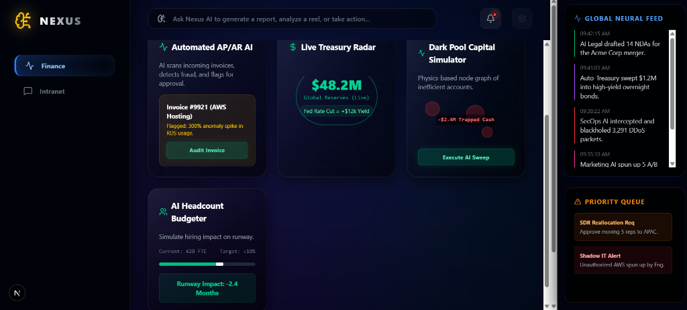

<div align="center">
  
  <h1>Nexus AOS</h1>
  <p><b>Data-Sovereign Enterprise Operating System</b></p>
</div>

<br/>

## 🚀 Overview
Nexus AOS is an advanced prototype of a fully localized, data-sovereign enterprise operating system. It proves that modern corporations can leverage cutting-edge AI (Llama 3) for strategic departmental automation **without** exposing sensitive proprietary data to 3rd-party APIs. 

This repository contains the **Frontend Architecture** (Next.js & Tailwind CSS) which drives the highly-responsive, 60fps executive UI.

*(Note: Backend FastAPI logic and AI orchestration scripts have been deliberately excluded from this public repository to protect proprietary intellectual property).*

<br/>

<div align="center">
  
</div>

<br/>

## ✨ Key Features

- **🌐 The Neural Intranet** - A cognitive assistant capable of routing everything from micro-tasks (HR sick leave) to massive strategic ideation.
- **🛡️ Zero-Trust Security Gateway** - Cryptographic authentication utilizing the Web Crypto API to mathematically hash credentials locally before transmission.
- **💼 Executive Dashboards** - Complex, responsive grid layouts built for CEOs, featuring live P&L data and infrastructure metrics.
- **🧠 Departmental Autonomy** - Dedicated, isolated workspaces for Engineering, Marketing, Legal, and HR to execute autonomous actions (e.g., "Tech Debt Bankruptcy" protocols).

<br/>

## 🏗️ The Sovereign Architecture

```text
┌─────────────────────────────────────────────────────────┐
│                 FRONTEND (This Repo)                    │
│    Next.js 15 │ Tailwind CSS │ React │ TypeScript       │
└────────────────────────────┬────────────────────────────┘
                             │ (REST API via localhost)
┌────────────────────────────▼────────────────────────────┐
│                  BACKEND (Hidden)                       │
│             FastAPI (Python) │ Uvicorn                  │
└────────────────────────────┬────────────────────────────┘
                             │ (Local Execution)
┌────────────────────────────▼────────────────────────────┐
│                    LOCALIZED AI                         │
│               Llama 3 (Data Sovereign)                  │
└─────────────────────────────────────────────────────────┘
```

<br/>

## 💻 Tech Stack

| Layer | Technology |
| :--- | :--- |
| **Frontend Framework** | Next.js 15 (App Router), React |
| **Styling** | Tailwind CSS, CSS Grid/Flexbox |
| **Language** | TypeScript |
| **Security** | Web Crypto API (SHA-256 Hashing) |
| **Backend (Unlisted)** | Python 3.11, FastAPI, Llama 3 (Local) |

<br/>

## 📂 Repository Structure (Frontend)

```text
nexus-aos/
├── public/                 # Static assets and icons
├── src/
│   └── app/
│       ├── page.tsx        # Main Executive Dashboard & Neural Intranet
│       ├── layout.tsx      # Root layout & font configuration
│       └── globals.css     # Global Tailwind imports
├── tailwind.config.ts      # Tailwind styling configuration
├── next.config.ts          # Next.js build parameters
└── package.json            # Dependencies
```

<br/>

## 🚀 Getting Started (UI Demo)

To run the frontend UI locally on your machine:

### 1. Clone the Repository
```bash
git clone https://github.com/Rudra225/nexus-aos.git
cd nexus-aos
```

### 2. Install Dependencies
```bash
npm install
```

### 3. Run the Development Server
```bash
npm run dev
```

Open [http://localhost:3000](http://localhost:3000) in your browser to view the executive dashboard.

<br/>

## 🔐 Security Notice
This repository is the frontend presentation layer. The proprietary AI models, backend routing logic, and system prompt architectures have been intentionally omitted to maintain data sovereignty and intellectual property security.
